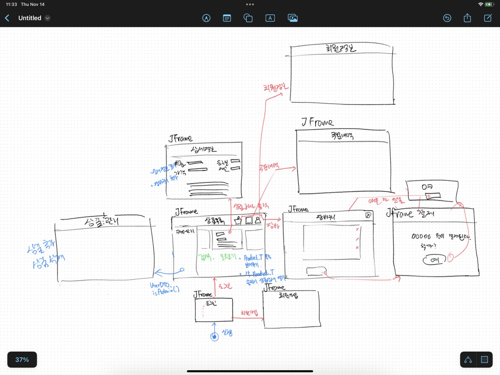
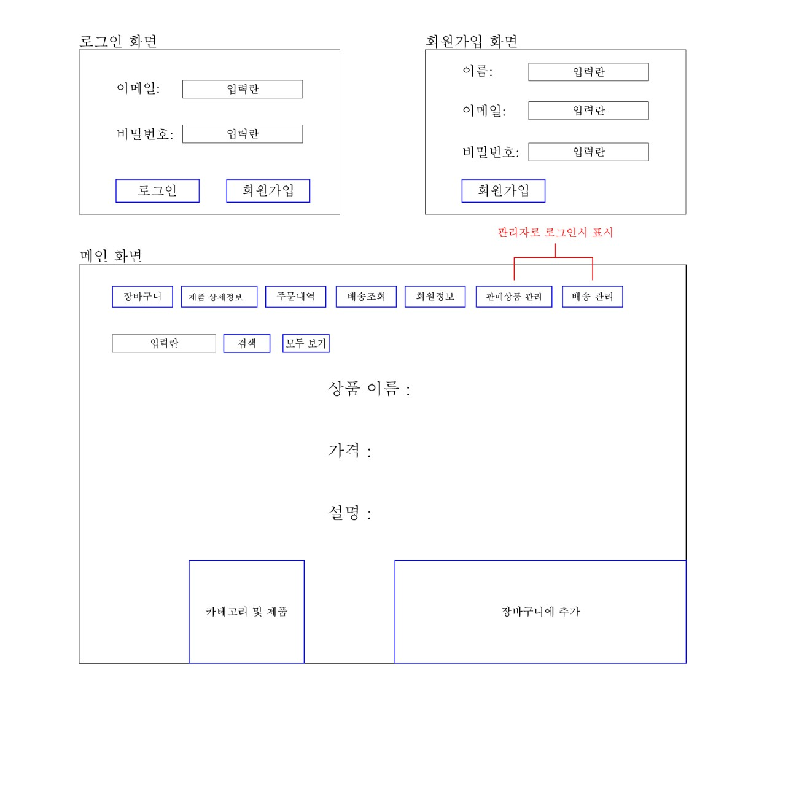
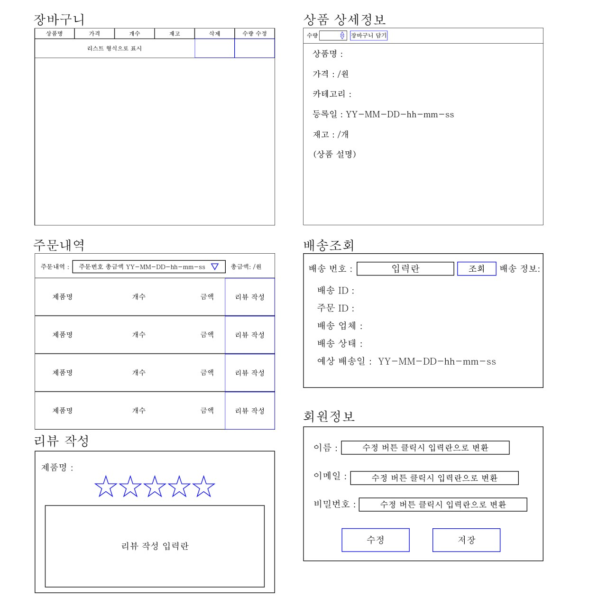
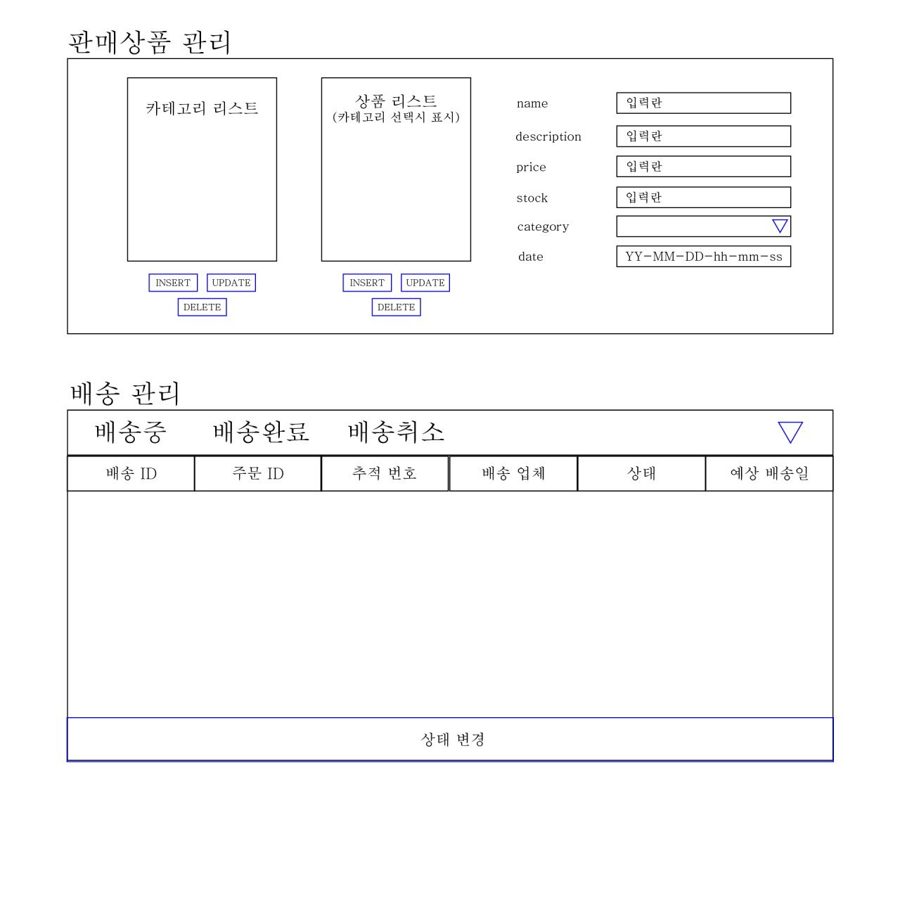
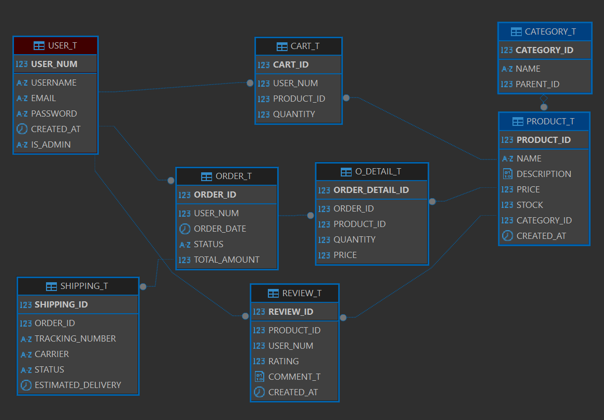

# Java Swing으로 만든 쇼핑몰 프로그램!!

## 중요!!!

원래 swing은 실무에서 쓰지 않습니다. swing에 너무 집중하지 말아주세요. 

## UI 차트 (스케치)

## UI 차트

## 테이블 구조

## 요구사항

[https://nemi.dev/ks501/spec.html](https://nemi.dev/ks501/spec.html)
